# Copilot Chat OpenAI Proxy - Architectural Documentation

## Executive Summary

The **Copilot Chat OpenAI Proxy** is a VS Code extension providing a REST API proxy server that routes OpenAI-compatible requests through GitHub Copilot's language models.

**Key Features:**
- ✅ OpenAI API-compatible interface
- ✅ Zero OpenAI API key required
- ✅ Local development server (localhost:8080)
- ✅ Built-in Swagger UI documentation
- ✅ Multi-model support via GitHub Copilot
- ✅ Tool calls (MCP) support

---

## 1. System Architecture Overview

### High-Level System Architecture

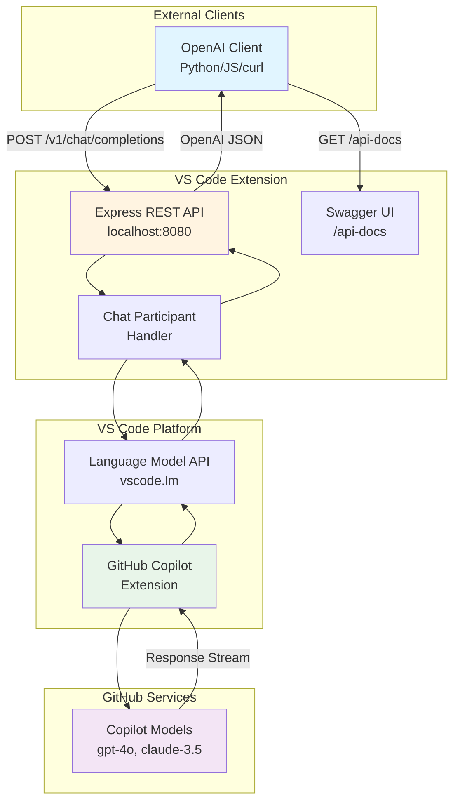

### Technology Stack

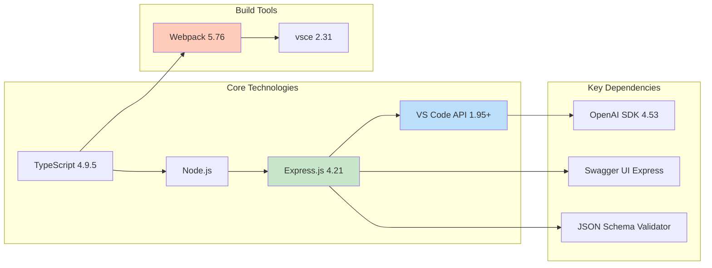

---

## 2. Component Architecture

### Component Diagram

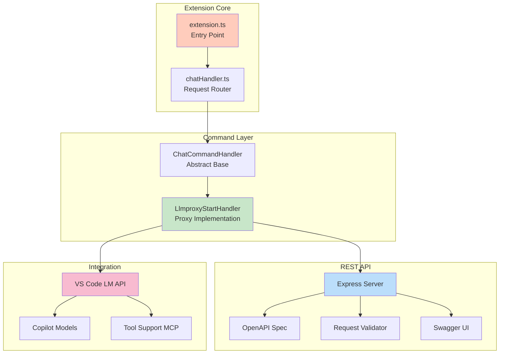

---

## 3. Data Flow Architecture

### Request Flow - Chat Completion

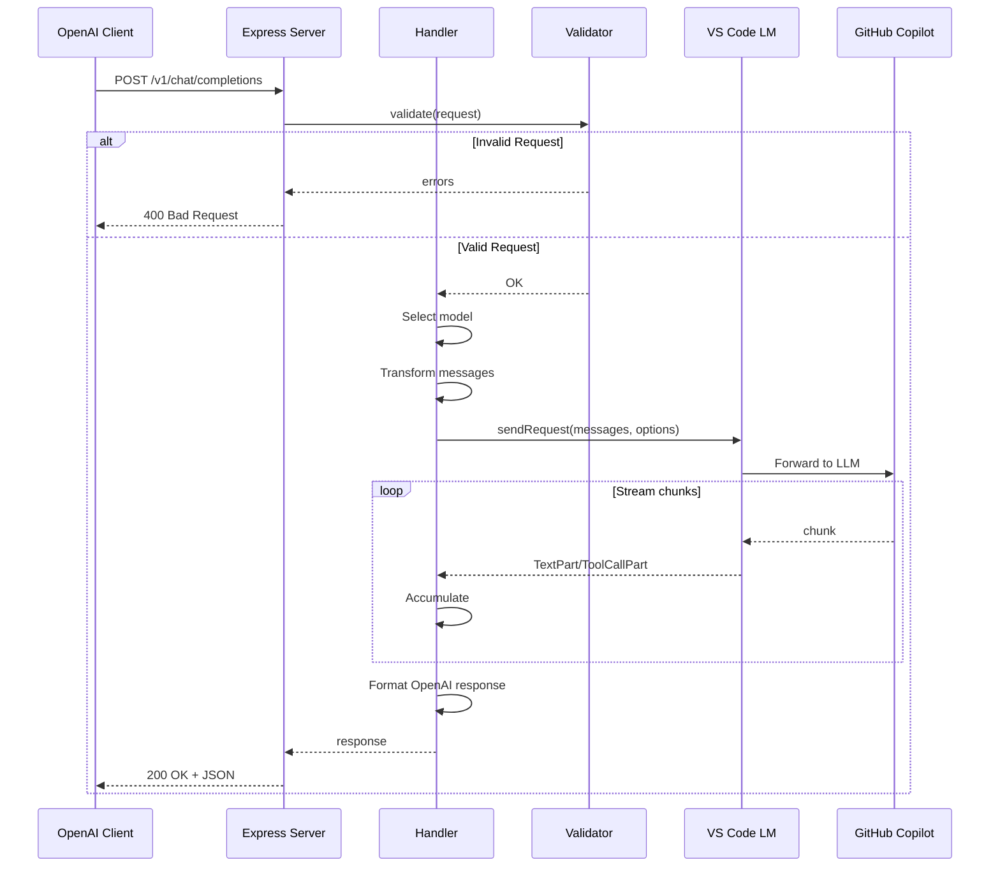

### Tool Call Flow (MCP)

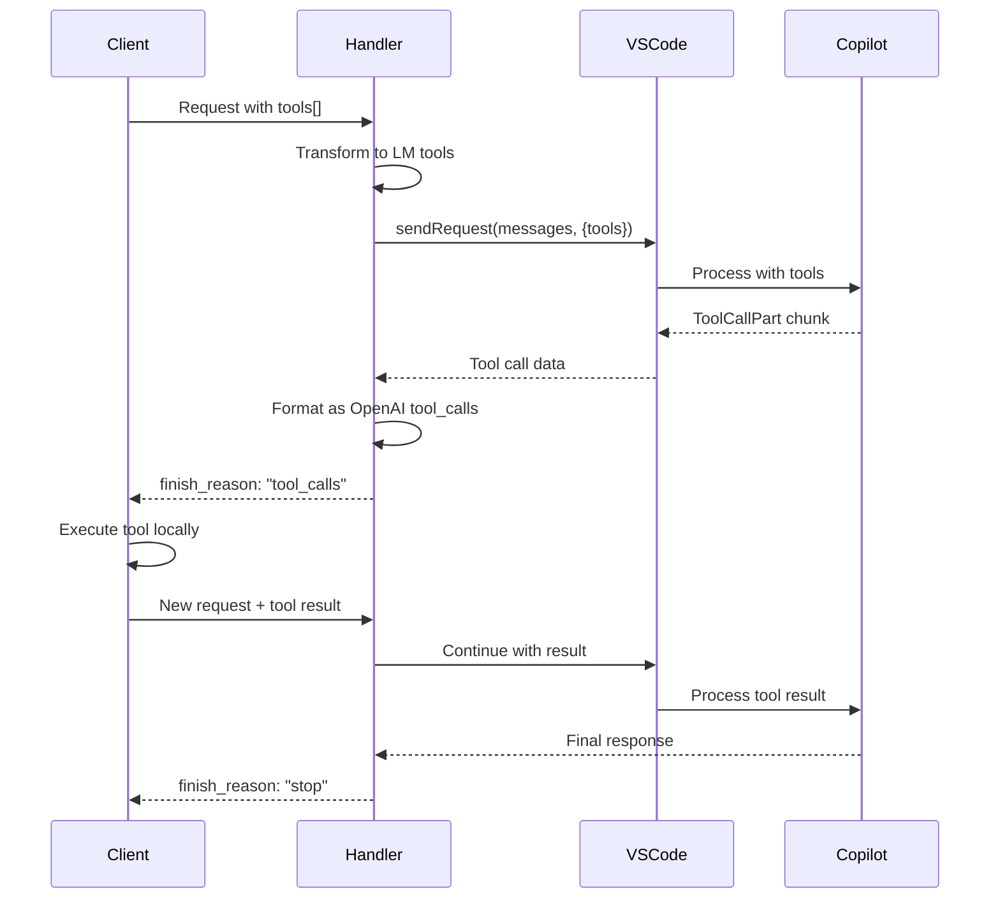

---

## 4. User Interaction Flows

### Starting the Proxy Server

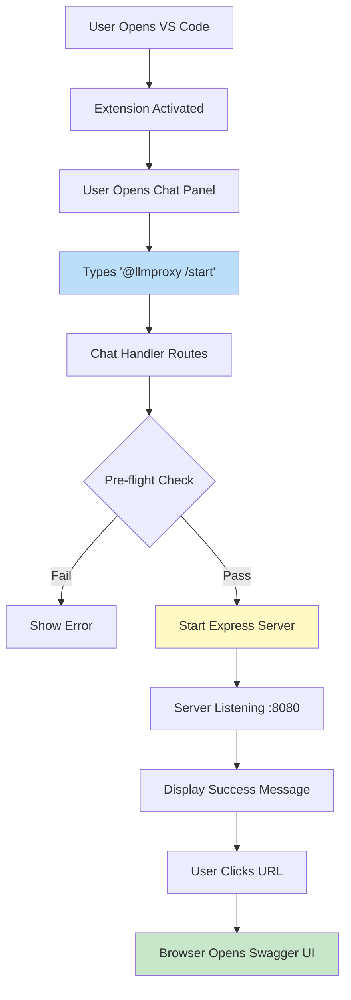

### API Request Journey

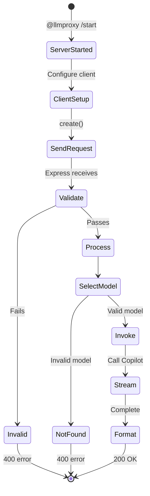

---

## 5. Security Architecture

### Security Layers

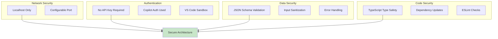

### Threat Mitigation

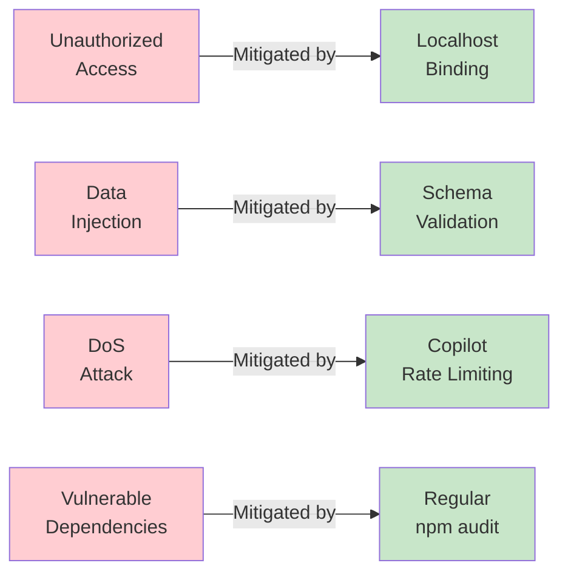

---

## 6. Deployment Architecture

### Build & Package Pipeline

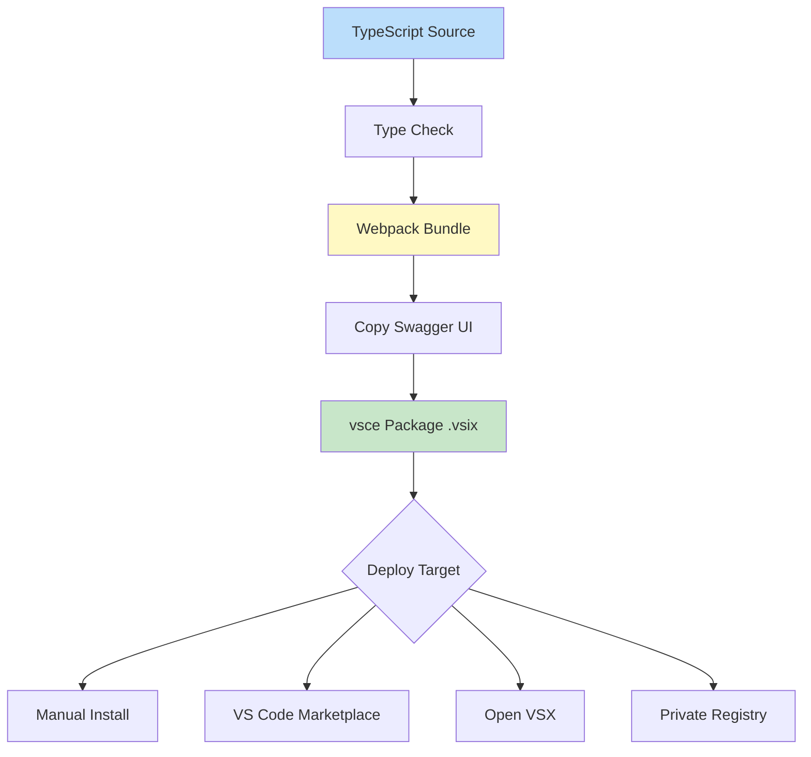

### Runtime Architecture

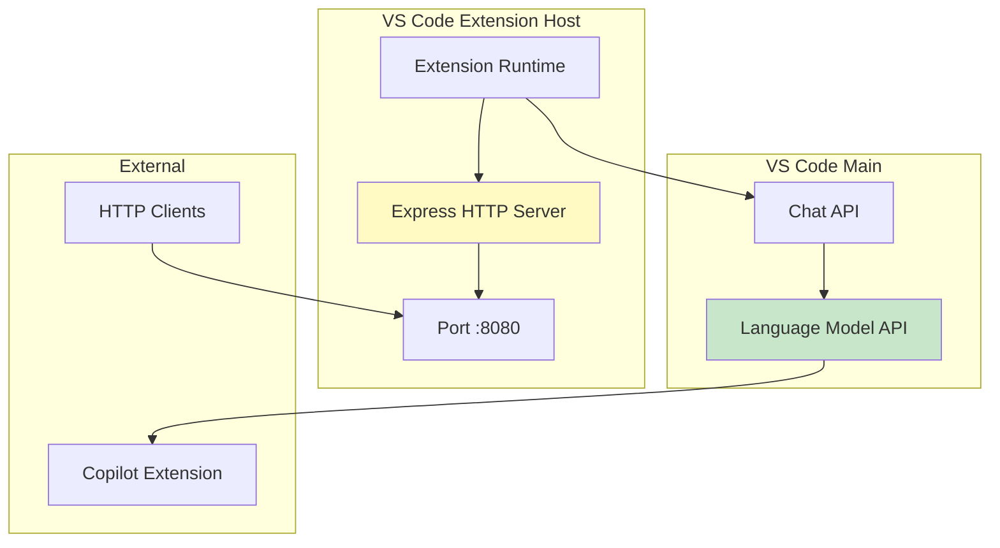

---

## 7. API Architecture

### REST API Endpoints

```mermaid
graph TB
    A["GET /v1/chat/models"] --> B[List Available Models]
    C["POST /v1/chat/completions"] --> D[Create Chat Completion]
    E["GET /api-docs"] --> F[Swagger UI Documentation]
    
    B --> G[200 OK: models[]]
    D --> H{Process}
    H --> I[200 OK: completion]
    H --> J[400: validation error]
    H --> K[500: server error]
    
    style C fill:#bbdefb
    style I fill:#c8e6c9
    style J fill:#ffccbc
    style K fill:#ffccbc
```

### Message Transformation

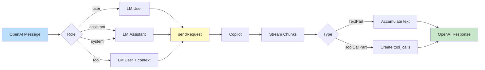

---

## 8. Extension Lifecycle

### Activation Flow

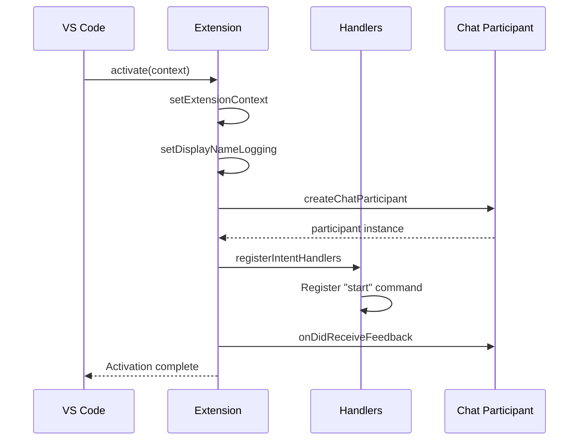

### Command Execution

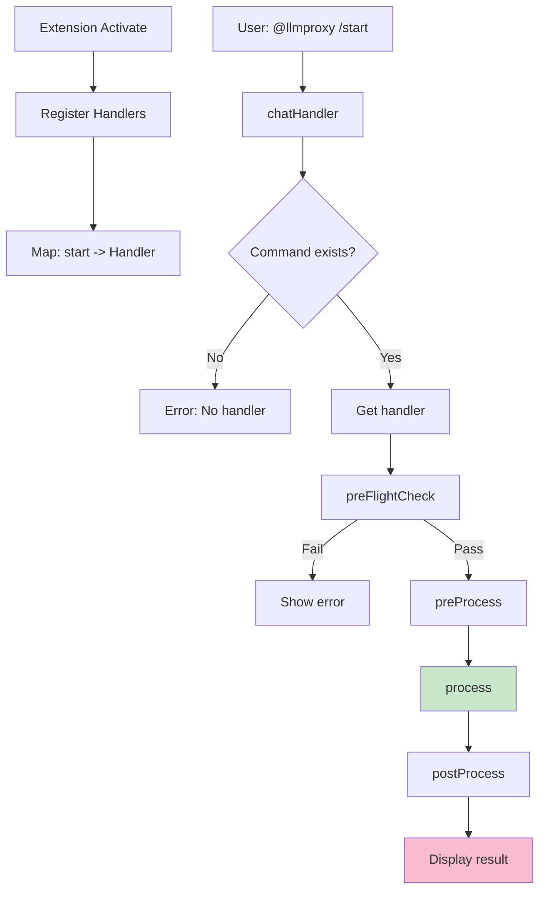

---

## 9. Design Patterns

### Patterns Used

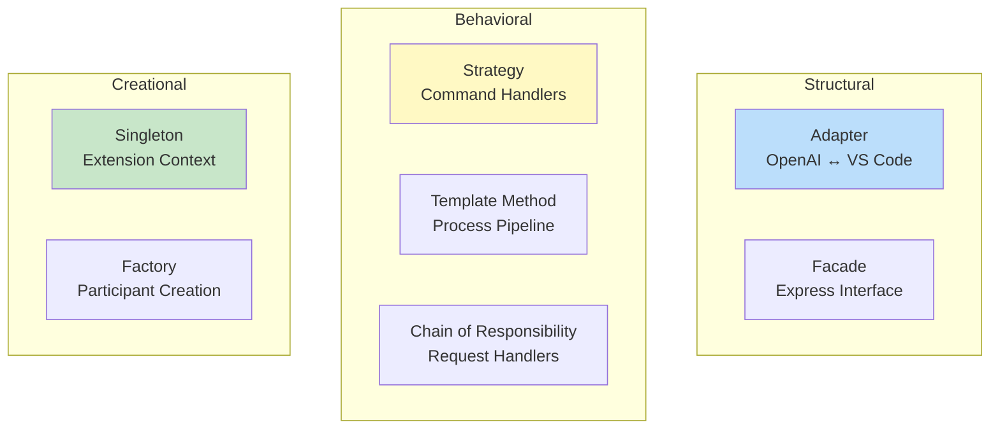

### Class Hierarchy

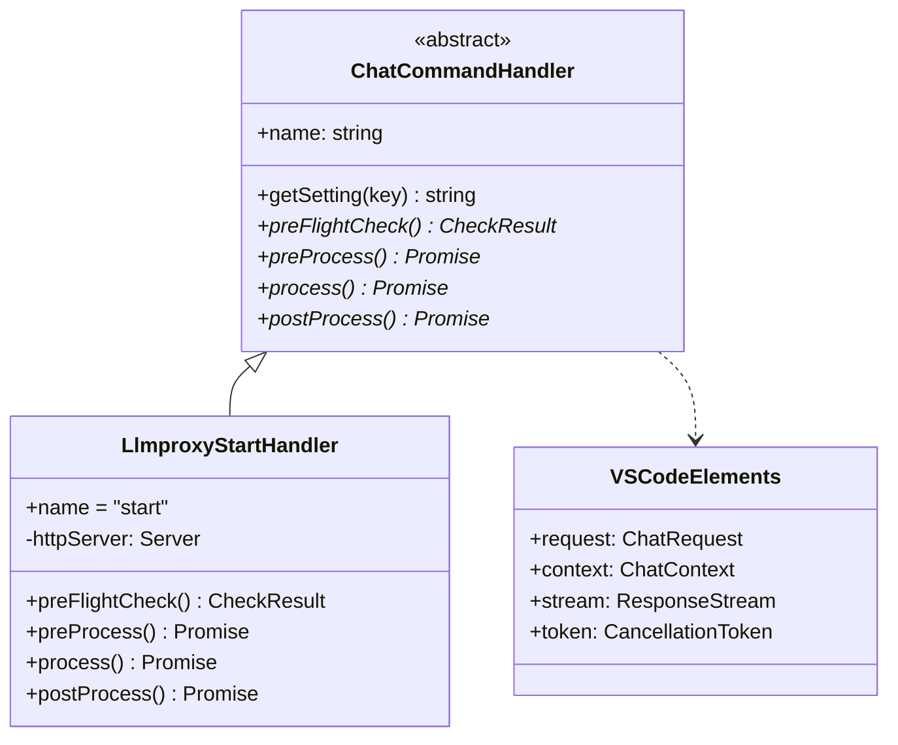

---

## 10. Performance & Scalability

### Latency Breakdown

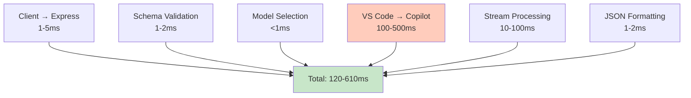

### Scalability Considerations

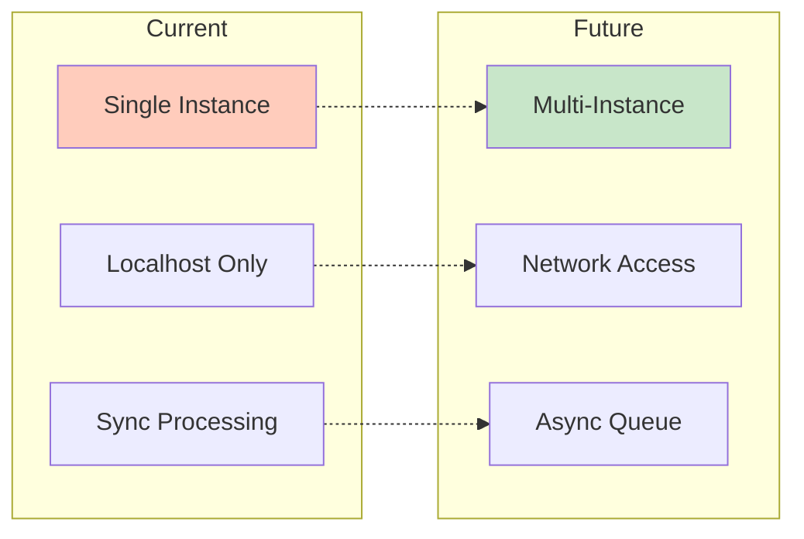

---

## Summary

This architecture provides a robust, secure, and extensible proxy solution that:

1. **Bridges APIs**: Seamlessly translates OpenAI API calls to VS Code Language Model API
2. **Leverages Existing Auth**: Uses GitHub Copilot's authentication infrastructure
3. **Ensures Security**: Localhost-only binding with schema validation
4. **Provides Documentation**: Integrated Swagger UI for API exploration
5. **Supports Advanced Features**: Tool calls (MCP), multiple models, streaming

The extension follows VS Code best practices and design patterns, ensuring maintainability and extensibility for future enhancements.
