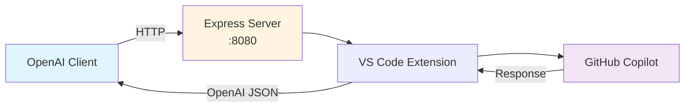
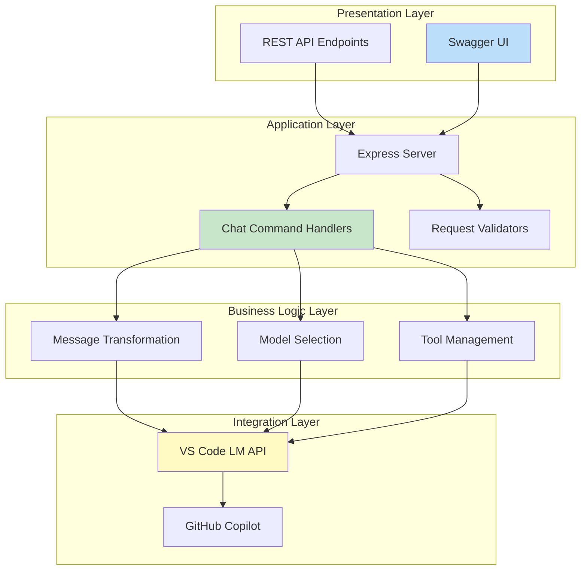
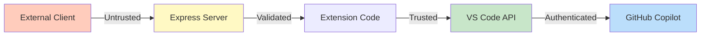
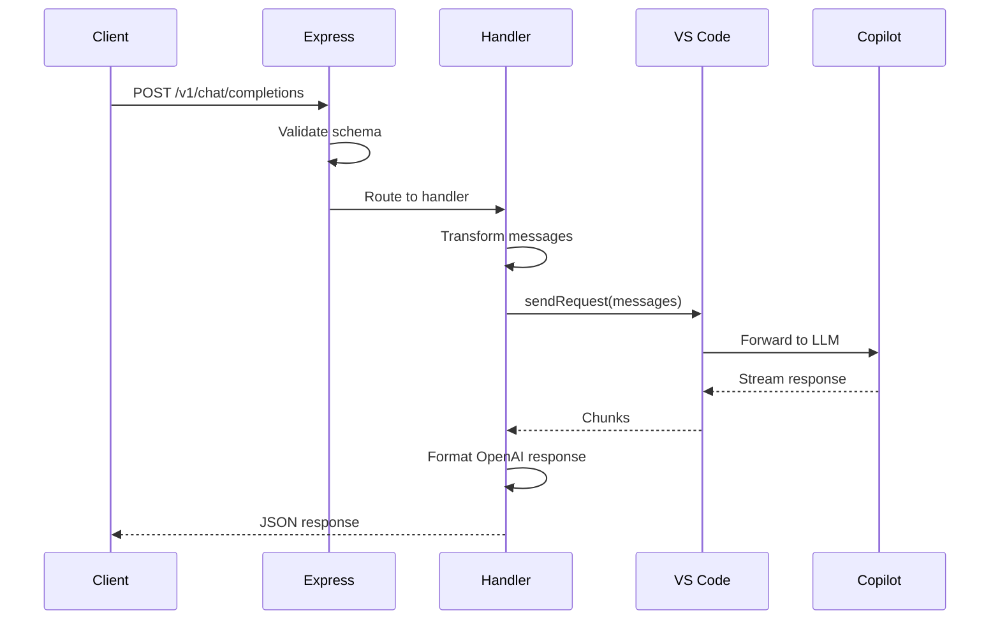
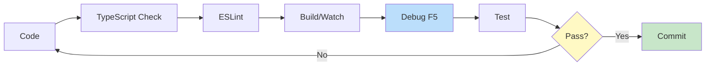
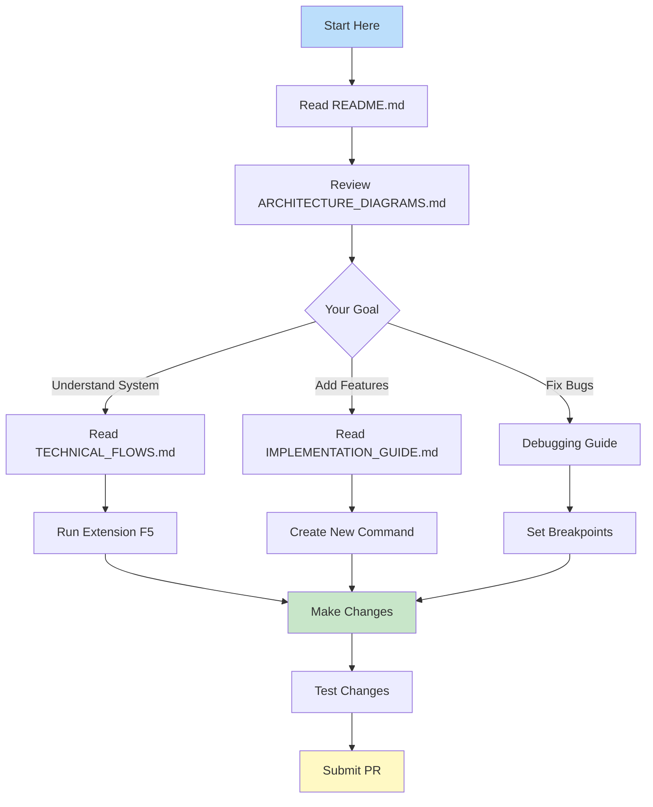
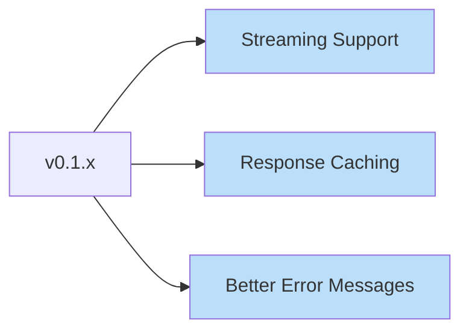
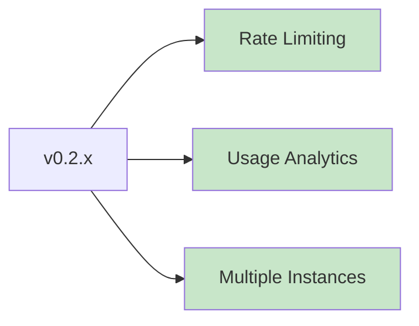
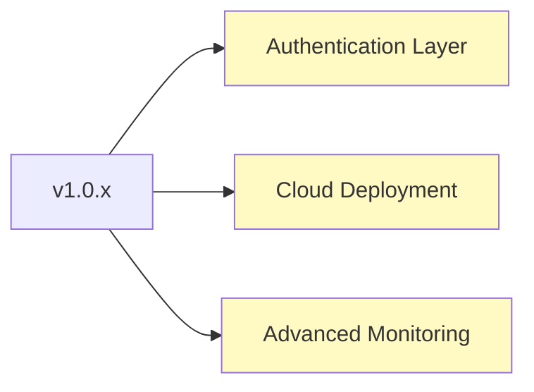

# Architecture Documentation Index

## Complete Architectural Overview

This is the central hub for all architectural documentation for the **Copilot Chat OpenAI Proxy** VS Code extension.

---

## 📚 Documentation Suite

### 1. [ARCHITECTURE_DIAGRAMS.md](./ARCHITECTURE_DIAGRAMS.md)
**High-level system architecture and component diagrams**

Covers:
- System architecture overview with technology stack
- Component architecture and module dependencies
- Data flow architecture for requests and tool calls
- User interaction flows and state diagrams
- Security architecture and threat mitigation
- Deployment architecture and runtime structure
- REST API architecture and message transformation
- Extension lifecycle and design patterns
- Performance characteristics and scalability

**Best for**: Understanding the overall system design and major components

### 2. [TECHNICAL_FLOWS.md](./TECHNICAL_FLOWS.md)
**Detailed technical implementation flows**

Covers:
- Extension initialization sequence
- HTTP request processing pipeline
- Message transformation details (OpenAI ↔ VS Code LM)
- Tool call implementation (MCP support)
- Error handling strategies and patterns
- Configuration management hierarchy
- Advanced features (streaming, multi-model)

**Best for**: Understanding detailed implementation flows and data transformations

### 3. [IMPLEMENTATION_GUIDE.md](./IMPLEMENTATION_GUIDE.md)
**Developer guide with practical implementation details**

Covers:
- Code structure and module organization
- Key implementation patterns (Template Method, Singleton)
- Adding new chat commands and REST endpoints
- Testing strategy (unit, integration, manual)
- Build and package process
- Debugging guide and troubleshooting
- Performance optimization strategies

**Best for**: Developers implementing new features or debugging issues

### 4. [architecture.md](./architecture.md)
**Original architecture documentation**

Covers:
- Extension metadata and structure
- Component descriptions
- Build system overview
- Dependencies and integration points

**Best for**: Quick reference and historical context

---

## 🎯 Quick Navigation

### By Role

#### **Architecture Review**
1. Start with [ARCHITECTURE_DIAGRAMS.md](./ARCHITECTURE_DIAGRAMS.md) - System overview
2. Review [Security Architecture](#security-architecture) section
3. Examine [Deployment Architecture](#deployment-architecture)

#### **New Developer Onboarding**
1. Read [ARCHITECTURE_DIAGRAMS.md](./ARCHITECTURE_DIAGRAMS.md) - System overview
2. Study [TECHNICAL_FLOWS.md](./TECHNICAL_FLOWS.md) - Request processing
3. Follow [IMPLEMENTATION_GUIDE.md](./IMPLEMENTATION_GUIDE.md) - Code structure

#### **Feature Development**
1. Review [Component Architecture](./ARCHITECTURE_DIAGRAMS.md#component-architecture)
2. Study [Adding New Features](./IMPLEMENTATION_GUIDE.md#adding-new-features)
3. Follow [Testing Strategy](./IMPLEMENTATION_GUIDE.md#testing-strategy)

#### **Security Audit**
1. Examine [Security Architecture](./ARCHITECTURE_DIAGRAMS.md#security-architecture)
2. Review [Threat Mitigation](./ARCHITECTURE_DIAGRAMS.md#threat-mitigation)
3. Study [Error Handling](./TECHNICAL_FLOWS.md#error-handling-strategies)

#### **Operations & Deployment**
1. Review [Deployment Architecture](./ARCHITECTURE_DIAGRAMS.md#deployment-architecture)
2. Study [Build Pipeline](./IMPLEMENTATION_GUIDE.md#build-and-package-process)
3. Follow [Debugging Guide](./IMPLEMENTATION_GUIDE.md#debugging-guide)

---

## 🔑 Key Concepts

### System Overview



**Core Function**: Proxy OpenAI-compatible API requests to GitHub Copilot's language models

### Key Value Propositions

1. **Zero OpenAI API Key**: Leverages existing GitHub Copilot subscription
2. **API Compatibility**: Standard OpenAI API format for easy integration
3. **Local Development**: Runs on localhost:8080 for security
4. **Multi-Model Support**: Access various models through Copilot (gpt-4o, claude-3.5)
5. **Tool Support**: MCP (Model Context Protocol) for function calling
6. **Built-in Docs**: Swagger UI for API exploration

---

## 📊 Architectural Layers

### Layer Breakdown



---

## 🔐 Security Model

### Security Principles

1. **Network Isolation**: Localhost-only binding prevents external access
2. **No Credentials Storage**: No API keys stored or transmitted
3. **Delegated Authentication**: Uses VS Code and Copilot's existing auth
4. **Input Validation**: JSON Schema validation on all requests
5. **Error Sanitization**: No sensitive data in error messages

### Trust Boundaries



---

## 🚀 Request Flow Summary

### High-Level Request Flow



### Processing Steps

1. **Request Reception**: Express receives HTTP POST
2. **Validation**: JSON Schema validates request structure
3. **Model Selection**: Find requested model from available models
4. **Transformation**: Convert OpenAI messages to VS Code LM format
5. **Tool Registration**: Transform tools to LM tool format (if any)
6. **LM Invocation**: Call VS Code Language Model API
7. **Streaming**: Process response chunks (text or tool calls)
8. **Response Formatting**: Convert to OpenAI-compatible JSON
9. **Response Delivery**: Return to client

---

## 🛠️ Development Workflow

### Development Cycle



### Quick Commands

```bash
# Development
npm run watch              # Watch mode for development
npm run lint               # Lint code

# Testing
npm run test               # Run tests
npm run test:integration   # Integration tests only

# Building
npm run compile            # Webpack production build
npm run package:full       # Create .vsix package

# Debugging
# Press F5 in VS Code       # Launch Extension Development Host
```

---

## 📈 Extension Statistics

### Codebase Metrics

| Component | Files | Lines | Purpose |
|-----------|-------|-------|---------|
| Extension Core | 2 | ~130 | Activation & lifecycle |
| Command Handlers | 4 | ~600 | Command processing |
| REST API | 1 | ~520 | HTTP server & routes |
| Utilities | 6 | ~200 | Logger, settings, etc |
| **Total** | **20** | **~1,450** | Core functionality |

### API Endpoints

| Endpoint | Method | Purpose |
|----------|--------|---------|
| `/v1/chat/completions` | POST | Create chat completion |
| `/v1/chat/models` | GET | List available models |
| `/api-docs` | GET | Swagger UI documentation |

### Supported Features

- ✅ Chat completions (OpenAI compatible)
- ✅ Multiple models via Copilot
- ✅ Tool calls (MCP/function calling)
- ✅ Temperature control
- ✅ Request validation
- ✅ Error handling
- ⏳ Streaming responses (TODO)
- ⏳ Rate limiting (future)

---

## 🎓 Learning Path

### For New Contributors



### Recommended Reading Order

1. **Week 1: Understanding**
   - Day 1-2: README.md + ARCHITECTURE_DIAGRAMS.md
   - Day 3-4: TECHNICAL_FLOWS.md
   - Day 5: Run and experiment with extension

2. **Week 2: Development**
   - Day 1-2: IMPLEMENTATION_GUIDE.md
   - Day 3-4: Code reading (extension.ts → chatHandler.ts → llmproxyStartHandler.ts)
   - Day 5: Simple modification

3. **Week 3: Contribution**
   - Implement a new feature
   - Write tests
   - Submit pull request

---

## 🔍 Common Scenarios

### Scenario: Adding a New Model

**Documents**: [IMPLEMENTATION_GUIDE.md](./IMPLEMENTATION_GUIDE.md#adding-new-features)

1. Model selection happens automatically via `vscode.lm.selectChatModels()`
2. Client specifies model ID in request
3. Handler finds model in available models array
4. No code changes needed - models from Copilot are discovered automatically

### Scenario: Adding Authentication

**Documents**: [IMPLEMENTATION_GUIDE.md](./IMPLEMENTATION_GUIDE.md#authentication-layer-future)

1. Add middleware to Express app
2. Validate API key or JWT token
3. Return 401/403 for unauthorized requests
4. Update OpenAPI spec with security schemes

### Scenario: Debugging Request Failures

**Documents**: [IMPLEMENTATION_GUIDE.md](./IMPLEMENTATION_GUIDE.md#debugging-guide)

1. Set breakpoint in `llmproxyStartHandler.ts`
2. Press F5 to launch debug host
3. Trigger request from client
4. Inspect request, validation, and model selection
5. Check error responses and logs

### Scenario: Understanding Tool Calls

**Documents**: [TECHNICAL_FLOWS.md](./TECHNICAL_FLOWS.md#tool-call-implementation)

1. Client sends tools array in request
2. Handler transforms to `LanguageModelChatTool` format
3. VS Code LM API includes tools in request
4. Copilot decides to call tool
5. Handler receives `LanguageModelToolCallPart`
6. Handler formats as OpenAI tool_call response
7. Client executes tool and sends result back

---

## 📝 Design Decisions

### Why Express Server?

- **Familiar**: Well-known web framework
- **Middleware**: Easy to add validation, logging, etc.
- **Swagger**: Built-in support via swagger-ui-express
- **Lightweight**: Minimal overhead for local proxy

### Why OpenAI API Compatibility?

- **Ecosystem**: Large ecosystem of compatible tools
- **Libraries**: Existing OpenAI client libraries work out-of-the-box
- **Standards**: Well-documented and widely understood API
- **Migration**: Easy to switch from OpenAI to Copilot

### Why Template Method Pattern?

- **Consistency**: All commands follow same lifecycle
- **Extensibility**: Easy to add new commands
- **Validation**: Centralized pre-flight checks
- **Testing**: Easier to test each phase independently

### Why Localhost Only?

- **Security**: No external attack surface
- **Simplicity**: No need for TLS certificates
- **Authentication**: Leverages VS Code's existing auth
- **Development**: Intended for local development use

---

## 🔮 Future Roadmap

### Near-term Enhancements



### Mid-term Features



### Long-term Vision



---

## 📞 Support & Contribution

### Getting Help

1. **Documentation**: Read this architectural documentation
2. **Issues**: Check GitHub Issues for existing problems
3. **Discussions**: Use GitHub Discussions for questions
4. **Code**: Review inline comments in source code

### Contributing

1. **Fork** the repository
2. **Read** ARCHITECTURE_DIAGRAMS.md and IMPLEMENTATION_GUIDE.md
3. **Create** a feature branch
4. **Implement** your changes following existing patterns
5. **Test** thoroughly (unit + integration)
6. **Document** your changes
7. **Submit** a pull request

### Code Review Checklist

- [ ] Follows existing code patterns
- [ ] Includes tests
- [ ] Updates documentation
- [ ] No breaking changes (or documented)
- [ ] ESLint passes
- [ ] TypeScript compiles without errors

---

## 📚 Related Resources

### External Documentation

- [VS Code Extension API](https://code.visualstudio.com/api)
- [VS Code Chat API](https://code.visualstudio.com/api/extension-guides/chat)
- [VS Code Language Model API](https://code.visualstudio.com/api/references/vscode-api#lm)
- [OpenAI API Reference](https://platform.openai.com/docs/api-reference)
- [Express.js Documentation](https://expressjs.com/)
- [Swagger/OpenAPI Specification](https://swagger.io/specification/)

### Internal Documentation

- [README.md](../README.md) - Project overview and quick start
- [customize-chat-participants.md](./customize-chat-participants.md) - Chat participant customization
- [publishing-guide.md](./publishing-guide.md) - Extension publishing guide

---

## 📊 Document Status

| Document | Last Updated | Status | Completeness |
|----------|--------------|--------|--------------|
| ARCHITECTURE_DIAGRAMS.md | 2024-10 | ✅ Current | 100% |
| TECHNICAL_FLOWS.md | 2024-10 | ✅ Current | 100% |
| IMPLEMENTATION_GUIDE.md | 2024-10 | ✅ Current | 100% |
| ARCHITECTURE_INDEX.md | 2024-10 | ✅ Current | 100% |
| architecture.md | 2024-10 | ✅ Current | 90% |

---

## Summary

This architectural documentation suite provides comprehensive coverage of the Copilot Chat OpenAI Proxy extension:

- **System Design**: High-level architecture and component interactions
- **Technical Details**: Detailed flows and implementation specifics
- **Developer Guide**: Practical patterns and development workflow
- **Quick Reference**: This index for easy navigation

Whether you're reviewing the architecture, developing new features, or troubleshooting issues, these documents provide the information you need to understand and work with the codebase effectively.

**Start with [ARCHITECTURE_DIAGRAMS.md](./ARCHITECTURE_DIAGRAMS.md) for a comprehensive system overview!**
