# Implementation Guide

## Developer Guide for Copilot Chat OpenAI Proxy

This guide provides detailed implementation insights, code structure, and development patterns for the Copilot Chat OpenAI Proxy extension.

---

## Table of Contents

1. [Code Structure](#code-structure)
2. [Key Implementation Patterns](#key-implementation-patterns)
3. [Adding New Features](#adding-new-features)
4. [Testing Strategy](#testing-strategy)
5. [Build and Package Process](#build-and-package-process)
6. [Debugging Guide](#debugging-guide)

---

## Code Structure

### Directory Organization

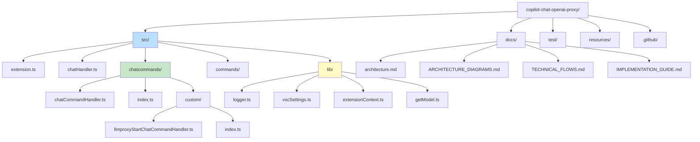
```mermaid
graph TB
    A[copilot-chat-openai-proxy/] --> B[src/]
    A --> C[docs/]
    A --> D[test/]
    A --> E[resources/]
    A --> F[.github/]
    
    B --> B1[extension.ts]
    B --> B2[chatHandler.ts]
    B --> B3[chatcommands/]
    B --> B4[commands/]
    B --> B5[lib/]
    
    B3 --> B31[chatCommandHandler.ts]
    B3 --> B32[index.ts]
    B3 --> B33[custom/]
    
    B33 --> B331[llmproxyStartChatCommandHandler.ts]
    B33 --> B332[index.ts]
    
    B5 --> B51[logger.ts]
    B5 --> B52[vscSettings.ts]
    B5 --> B53[extensionContext.ts]
    B5 --> B54[getModel.ts]
    
    C --> C1[architecture.md]
    C --> C2[ARCHITECTURE_DIAGRAMS.md]
    C --> C3[TECHNICAL_FLOWS.md]
    C --> C4[IMPLEMENTATION_GUIDE.md]
    
    style B fill:#bbdefb
    style B3 fill:#c8e6c9
    style B5 fill:#fff9c4
```

### Module Responsibilities

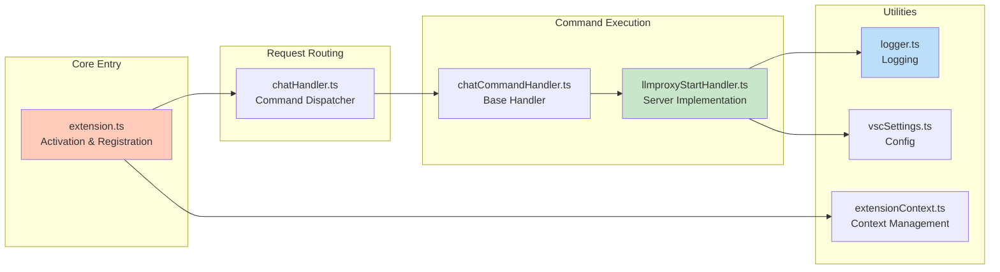
```mermaid
graph LR
    subgraph "Core Entry"
        A[extension.ts<br/>Activation & Registration]
    end
    
    subgraph "Request Routing"
        B[chatHandler.ts<br/>Command Dispatcher]
    end
    
    subgraph "Command Execution"
        C[chatCommandHandler.ts<br/>Base Handler]
        D[llmproxyStartHandler.ts<br/>Server Implementation]
    end
    
    subgraph "Utilities"
        E[logger.ts<br/>Logging]
        F[vscSettings.ts<br/>Config]
        G[extensionContext.ts<br/>Context Management]
    end
    
    A --> B
    B --> C
    C --> D
    D --> E
    D --> F
    A --> G
    
    style A fill:#ffccbc
    style D fill:#c8e6c9
    style E fill:#bbdefb
```

---

## Key Implementation Patterns

### Abstract Base Handler Pattern

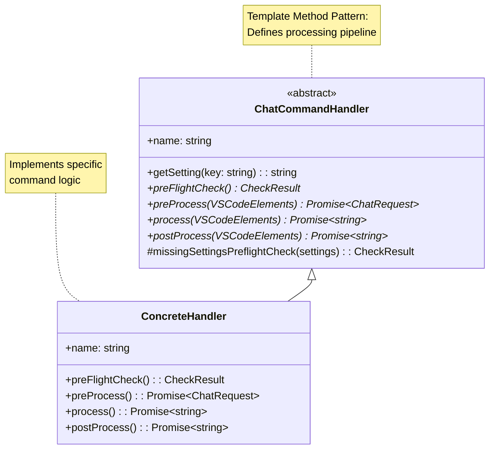
```mermaid
classDiagram
    class ChatCommandHandler {
        <<abstract>>
        +name: string
        +getSetting(key: string): string
        +preFlightCheck()* CheckResult
        +preProcess(VSCodeElements)* Promise~ChatRequest~
        +process(VSCodeElements)* Promise~string~
        +postProcess(VSCodeElements)* Promise~string~
        #missingSettingsPreflightCheck(settings): CheckResult
    }
    
    class ConcreteHandler {
        +name: string
        +preFlightCheck(): CheckResult
        +preProcess(): Promise~ChatRequest~
        +process(): Promise~string~
        +postProcess(): Promise~string~
    }
    
    ChatCommandHandler <|-- ConcreteHandler
    
    note for ChatCommandHandler "Template Method Pattern:<br/>Defines processing pipeline"
    note for ConcreteHandler "Implements specific<br/>command logic"
```

### Pipeline Processing Pattern

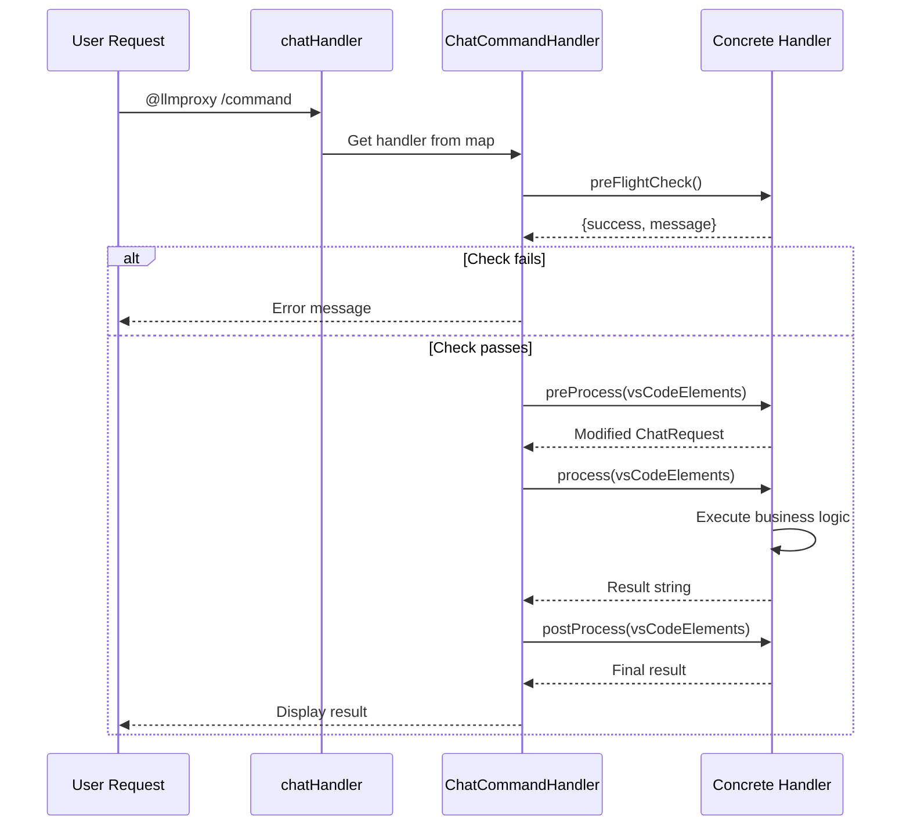
```mermaid
sequenceDiagram
    participant Client as User Request
    participant Router as chatHandler
    participant Base as ChatCommandHandler
    participant Impl as Concrete Handler
    
    Client->>Router: @llmproxy /command
    Router->>Base: Get handler from map
    Base->>Impl: preFlightCheck()
    Impl-->>Base: {success, message}
    
    alt Check fails
        Base-->>Client: Error message
    else Check passes
        Base->>Impl: preProcess(vsCodeElements)
        Impl-->>Base: Modified ChatRequest
        
        Base->>Impl: process(vsCodeElements)
        Impl->>Impl: Execute business logic
        Impl-->>Base: Result string
        
        Base->>Impl: postProcess(vsCodeElements)
        Impl-->>Base: Final result
        
        Base-->>Client: Display result
    end
```

### Singleton Context Pattern

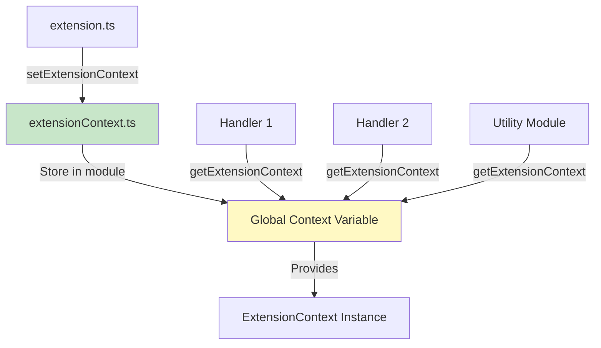
```mermaid
graph TB
    A[extension.ts] -->|setExtensionContext| B[extensionContext.ts]
    B -->|Store in module| C[Global Context Variable]
    
    D[Handler 1] -->|getExtensionContext| C
    E[Handler 2] -->|getExtensionContext| C
    F[Utility Module] -->|getExtensionContext| C
    
    C -->|Provides| G[ExtensionContext Instance]
    
    style B fill:#c8e6c9
    style C fill:#fff9c4
```

---

## Adding New Features

### Adding a New Chat Command

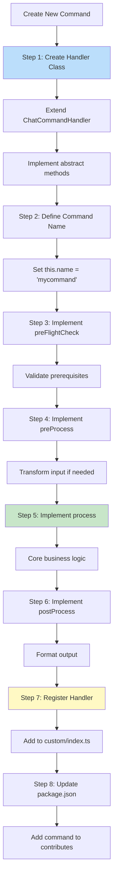
```mermaid
graph TD
    A[Create New Command] --> B[Step 1: Create Handler Class]
    B --> C[Extend ChatCommandHandler]
    C --> D[Implement abstract methods]
    
    D --> E[Step 2: Define Command Name]
    E --> F[Set this.name = 'mycommand']
    
    F --> G[Step 3: Implement preFlightCheck]
    G --> H[Validate prerequisites]
    
    H --> I[Step 4: Implement preProcess]
    I --> J[Transform input if needed]
    
    J --> K[Step 5: Implement process]
    K --> L[Core business logic]
    
    L --> M[Step 6: Implement postProcess]
    M --> N[Format output]
    
    N --> O[Step 7: Register Handler]
    O --> P[Add to custom/index.ts]
    
    P --> Q[Step 8: Update package.json]
    Q --> R[Add command to contributes]
    
    style B fill:#bbdefb
    style K fill:#c8e6c9
    style O fill:#fff9c4
```

### Example: Adding a "status" Command

```typescript
// src/chatcommands/custom/llmproxyStatusChatCommandHandler.ts
import { ChatCommandHandler, VSCodeElements } from "../chatCommandHandler";
import * as vscode from "vscode";

export class LlmproxyStatusChatCommandHandler extends ChatCommandHandler {
  public name: string = "status";

  preFlightCheck(): { success: boolean; message: string } {
    // No prerequisites needed
    return { success: true, message: "" };
  }

  async preProcess(vsCodeElements: VSCodeElements): Promise<vscode.ChatRequest> {
    return vsCodeElements.request;
  }

  async process(vsCodeElements: VSCodeElements): Promise<string> {
    // Check if server is running
    // Return status information
    return "Server status: Running on localhost:8080";
  }

  async postProcess(vsCodeElements: VSCodeElements): Promise<string | null> {
    return null; // Use result from process()
  }
}
```

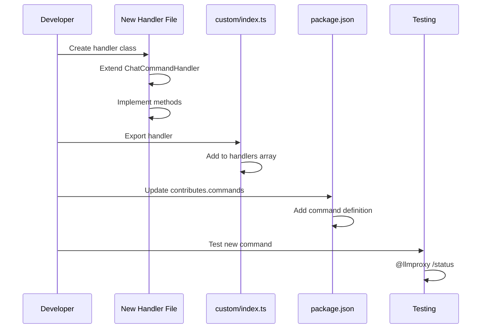
```mermaid
sequenceDiagram
    participant Dev as Developer
    participant File as New Handler File
    participant Index as custom/index.ts
    participant Package as package.json
    participant Test as Testing
    
    Dev->>File: Create handler class
    File->>File: Extend ChatCommandHandler
    File->>File: Implement methods
    Dev->>Index: Export handler
    Index->>Index: Add to handlers array
    Dev->>Package: Update contributes.commands
    Package->>Package: Add command definition
    Dev->>Test: Test new command
    Test->>Test: @llmproxy /status
```

### Adding a New REST Endpoint

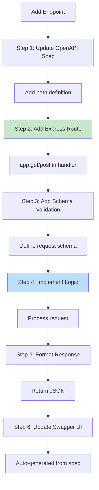
```mermaid
graph TD
    A[Add Endpoint] --> B[Step 1: Update OpenAPI Spec]
    B --> C[Add path definition]
    
    C --> D[Step 2: Add Express Route]
    D --> E[app.get/post in handler]
    
    E --> F[Step 3: Add Schema Validation]
    F --> G[Define request schema]
    
    G --> H[Step 4: Implement Logic]
    H --> I[Process request]
    
    I --> J[Step 5: Format Response]
    J --> K[Return JSON]
    
    K --> L[Step 6: Update Swagger UI]
    L --> M[Auto-generated from spec]
    
    style D fill:#c8e6c9
    style H fill:#bbdefb
```

---

## Testing Strategy

### Test Pyramid

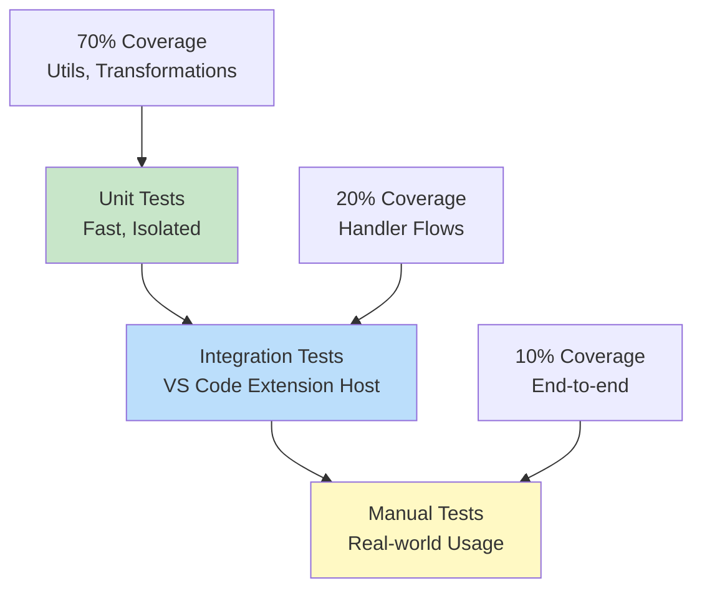
```mermaid
graph TB
    A[Unit Tests<br/>Fast, Isolated] --> B[Integration Tests<br/>VS Code Extension Host]
    B --> C[Manual Tests<br/>Real-world Usage]
    
    D[70% Coverage<br/>Utils, Transformations] --> A
    E[20% Coverage<br/>Handler Flows] --> B
    F[10% Coverage<br/>End-to-end] --> C
    
    style A fill:#c8e6c9
    style B fill:#bbdefb
    style C fill:#fff9c4
```

### Test Scenarios

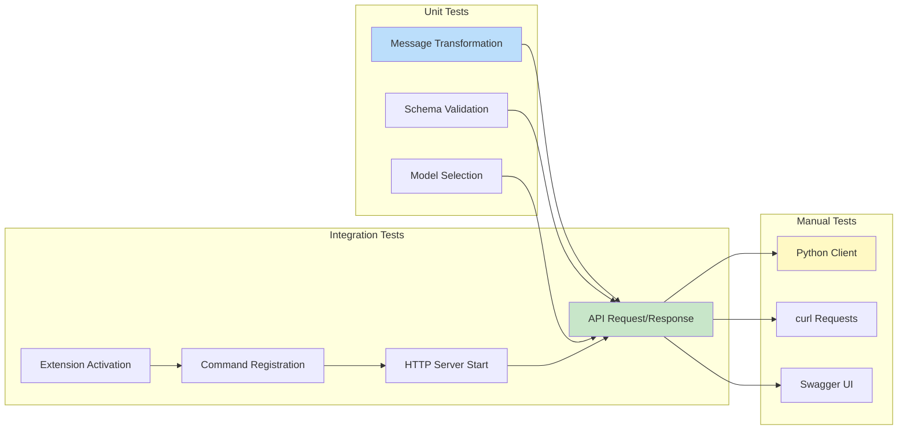
```mermaid
graph LR
    subgraph "Unit Tests"
        A1[Message Transformation]
        A2[Schema Validation]
        A3[Model Selection]
    end
    
    subgraph "Integration Tests"
        B1[Extension Activation]
        B2[Command Registration]
        B3[HTTP Server Start]
        B4[API Request/Response]
    end
    
    subgraph "Manual Tests"
        C1[Python Client]
        C2[curl Requests]
        C3[Swagger UI]
    end
    
    A1 --> B4
    A2 --> B4
    A3 --> B4
    B1 --> B2
    B2 --> B3
    B3 --> B4
    B4 --> C1
    B4 --> C2
    B4 --> C3
    
    style A1 fill:#bbdefb
    style B4 fill:#c8e6c9
    style C1 fill:#fff9c4
```

### Running Tests

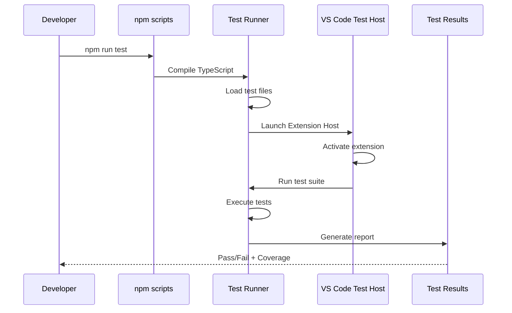
```mermaid
sequenceDiagram
    participant Dev as Developer
    participant npm as npm scripts
    participant Test as Test Runner
    participant VSCode as VS Code Test Host
    participant Result as Test Results
    
    Dev->>npm: npm run test
    npm->>Test: Compile TypeScript
    Test->>Test: Load test files
    Test->>VSCode: Launch Extension Host
    VSCode->>VSCode: Activate extension
    VSCode->>Test: Run test suite
    Test->>Test: Execute tests
    Test->>Result: Generate report
    Result-->>Dev: Pass/Fail + Coverage
```

---

## Build and Package Process

### Build Pipeline

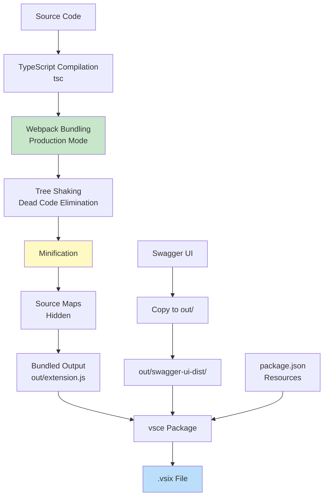
```mermaid
graph TD
    A[Source Code] --> B[TypeScript Compilation<br/>tsc]
    B --> C[Webpack Bundling<br/>Production Mode]
    C --> D[Tree Shaking<br/>Dead Code Elimination]
    D --> E[Minification]
    E --> F[Source Maps<br/>Hidden]
    
    G[Swagger UI] --> H[Copy to out/]
    
    F --> I[Bundled Output<br/>out/extension.js]
    H --> J[out/swagger-ui-dist/]
    
    I --> K[vsce Package]
    J --> K
    L[package.json<br/>Resources] --> K
    
    K --> M[.vsix File]
    
    style C fill:#c8e6c9
    style E fill:#fff9c4
    style M fill:#bbdefb
```

### Package Scripts Workflow


```mermaid
graph LR
    A[npm run package:prepare] --> B[Copy Swagger UI]
    B --> C[Switch .vscodeignore]
    C --> D[npm run compile]
    D --> E[Webpack production]
    
    E --> F[npm run package:vsix]
    F --> G[vsce package]
    G --> H[.vsix created]
    
    H --> I[npm run package:cleanup]
    I --> J[Restore .vscodeignore]
    
    style E fill:#c8e6c9
    style G fill:#bbdefb
```

### File Exclusion Strategy

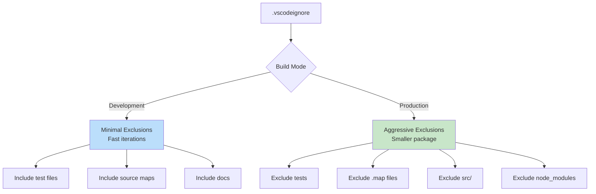
```mermaid
graph TB
    A[.vscodeignore] --> B{Build Mode}
    
    B -->|Development| C[Minimal Exclusions<br/>Fast iterations]
    B -->|Production| D[Aggressive Exclusions<br/>Smaller package]
    
    C --> C1[Include test files]
    C --> C2[Include source maps]
    C --> C3[Include docs]
    
    D --> D1[Exclude tests]
    D --> D2[Exclude .map files]
    D --> D3[Exclude src/]
    D --> D4[Exclude node_modules]
    
    style D fill:#c8e6c9
    style C fill:#bbdefb
```

---

## Debugging Guide

### VS Code Debug Configuration

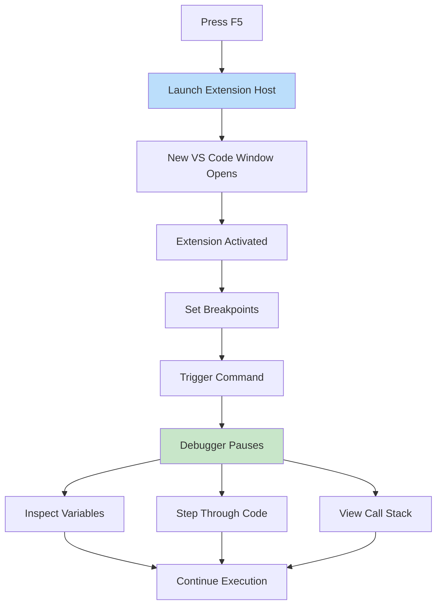
```mermaid
graph TD
    A[Press F5] --> B[Launch Extension Host]
    B --> C[New VS Code Window Opens]
    C --> D[Extension Activated]
    
    D --> E[Set Breakpoints]
    E --> F[Trigger Command]
    F --> G[Debugger Pauses]
    
    G --> H[Inspect Variables]
    G --> I[Step Through Code]
    G --> J[View Call Stack]
    
    H --> K[Continue Execution]
    I --> K
    J --> K
    
    style B fill:#bbdefb
    style G fill:#c8e6c9
```

### Debug Workflow

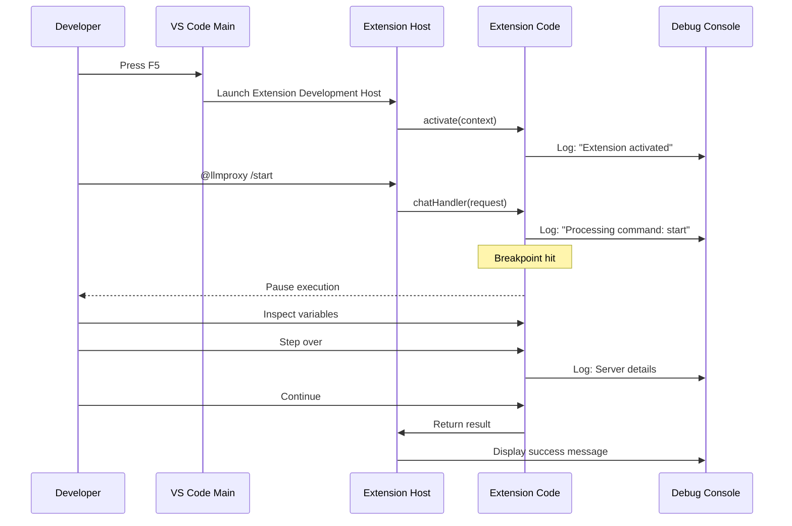
```mermaid
sequenceDiagram
    participant Dev as Developer
    participant IDE as VS Code Main
    participant Host as Extension Host
    participant Ext as Extension Code
    participant Debug as Debug Console
    
    Dev->>IDE: Press F5
    IDE->>Host: Launch Extension Development Host
    Host->>Ext: activate(context)
    Ext->>Debug: Log: "Extension activated"
    
    Dev->>Host: @llmproxy /start
    Host->>Ext: chatHandler(request)
    Ext->>Debug: Log: "Processing command: start"
    
    Note over Ext: Breakpoint hit
    Ext-->>Dev: Pause execution
    Dev->>Ext: Inspect variables
    Dev->>Ext: Step over
    Ext->>Debug: Log: Server details
    
    Dev->>Ext: Continue
    Ext->>Host: Return result
    Host->>Debug: Display success message
```

### Common Debug Scenarios

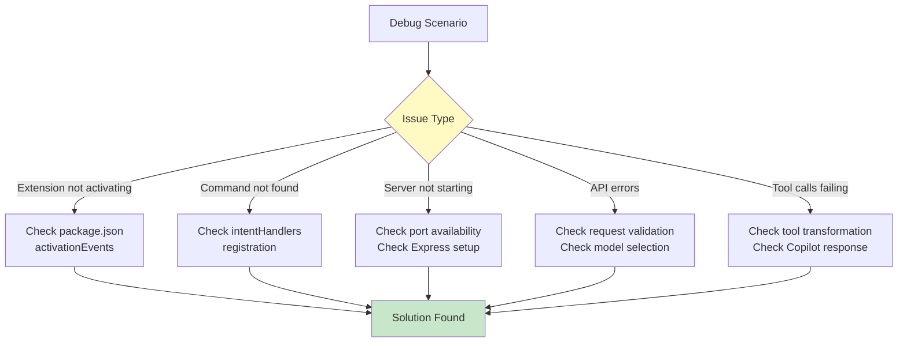
```mermaid
graph TB
    A[Debug Scenario] --> B{Issue Type}
    
    B -->|Extension not activating| C1[Check package.json<br/>activationEvents]
    B -->|Command not found| C2[Check intentHandlers<br/>registration]
    B -->|Server not starting| C3[Check port availability<br/>Check Express setup]
    B -->|API errors| C4[Check request validation<br/>Check model selection]
    B -->|Tool calls failing| C5[Check tool transformation<br/>Check Copilot response]
    
    C1 --> D[Solution Found]
    C2 --> D
    C3 --> D
    C4 --> D
    C5 --> D
    
    style B fill:#fff9c4
    style D fill:#c8e6c9
```

### Logging Best Practices

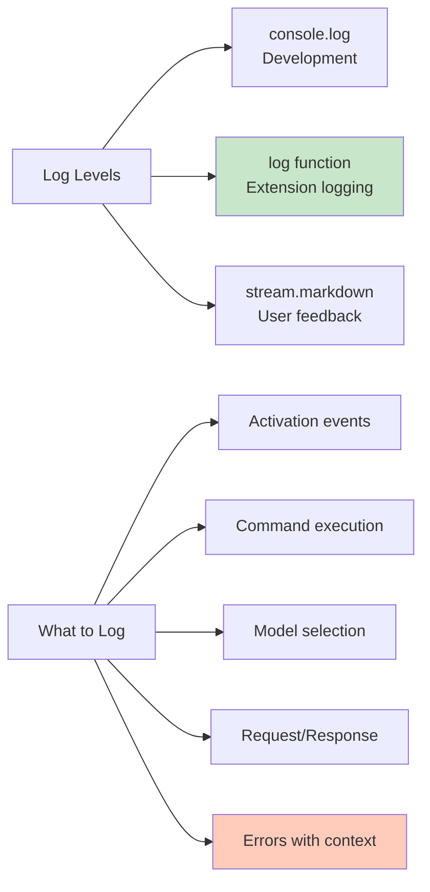
```mermaid
graph LR
    A[Log Levels] --> B[console.log<br/>Development]
    A --> C[log function<br/>Extension logging]
    A --> D[stream.markdown<br/>User feedback]
    
    E[What to Log] --> F[Activation events]
    E --> G[Command execution]
    E --> H[Model selection]
    E --> I[Request/Response]
    E --> J[Errors with context]
    
    style C fill:#c8e6c9
    style J fill:#ffccbc
```

---

## Advanced Implementation Topics

### Streaming Response Implementation

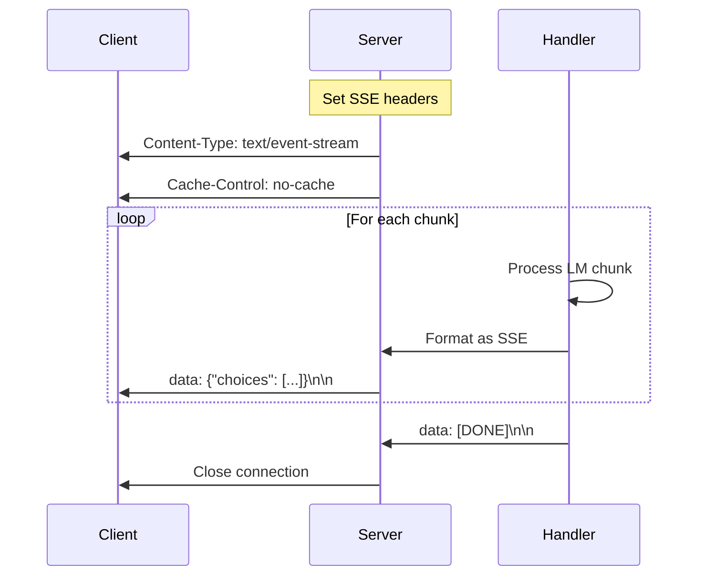
```mermaid
sequenceDiagram
    participant Client
    participant Server
    participant Handler
    
    Note over Server: Set SSE headers
    Server->>Client: Content-Type: text/event-stream
    Server->>Client: Cache-Control: no-cache
    
    loop For each chunk
        Handler->>Handler: Process LM chunk
        Handler->>Server: Format as SSE
        Server->>Client: data: {"choices": [...]}\n\n
    end
    
    Handler->>Server: data: [DONE]\n\n
    Server->>Client: Close connection
```

### Rate Limiting Strategy

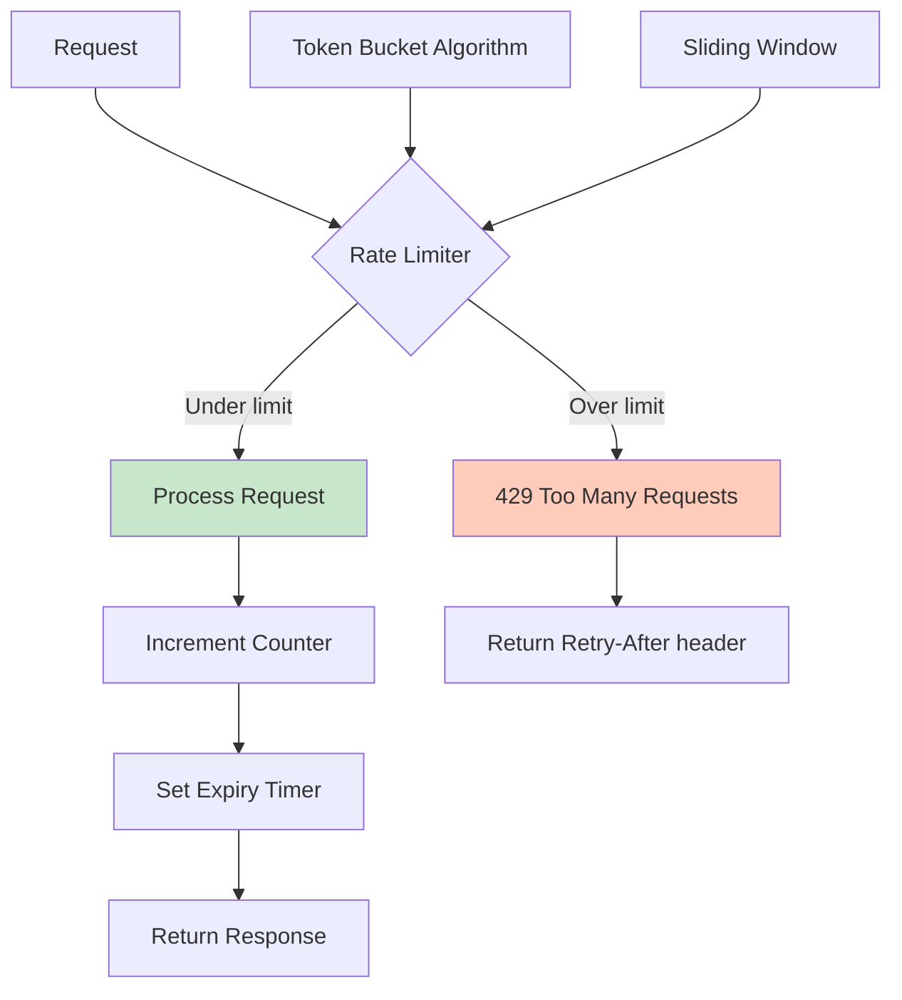
```mermaid
graph TB
    A[Request] --> B{Rate Limiter}
    B -->|Under limit| C[Process Request]
    B -->|Over limit| D[429 Too Many Requests]
    
    C --> E[Increment Counter]
    E --> F[Set Expiry Timer]
    F --> G[Return Response]
    
    D --> H[Return Retry-After header]
    
    I[Token Bucket Algorithm] --> B
    J[Sliding Window] --> B
    
    style C fill:#c8e6c9
    style D fill:#ffccbc
```

### Authentication Layer (Future)

```mermaid
graph TB
    A[Request] --> B[Auth Middleware]
    B --> C{Check Token}
    C -->|Valid| D[Verify Permissions]
    C -->|Invalid| E[401 Unauthorized]
    
    D -->|Authorized| F[Process Request]
    D -->|Not Authorized| G[403 Forbidden]
    
    F --> H[Return Response]
    
    I[API Key Header] --> B
    J[JWT Token] --> B
    K[OAuth2 Bearer] --> B
    
    style F fill:#c8e6c9
    style E fill:#ffccbc
    style G fill:#ffccbc
```

---

## Performance Optimization

### Optimization Strategies

```mermaid
graph LR
    subgraph "Code Optimization"
        A1[Lazy Loading]
        A2[Tree Shaking]
        A3[Code Splitting]
    end
    
    subgraph "Runtime Optimization"
        B1[Connection Pooling]
        B2[Response Caching]
        B3[Async Processing]
    end
    
    subgraph "Build Optimization"
        C1[Minification]
        C2[Bundle Size Reduction]
        C3[Source Map Optimization]
    end
    
    A1 --> Perf
    B1 --> Perf
    C1 --> Perf
    Perf[Performance<br/>Improvements]
    
    style Perf fill:#c8e6c9
```

### Memory Management

```mermaid
graph TB
    A[Memory Concerns] --> B[Large Request Bodies]
    A --> C[Stream Accumulation]
    A --> D[Context Retention]
    
    B --> E[Solution: Streaming Parser]
    C --> F[Solution: Chunk Processing]
    D --> G[Solution: Weak References]
    
    E --> H[Optimized Memory Usage]
    F --> H
    G --> H
    
    style A fill:#ffccbc
    style H fill:#c8e6c9
```

---

## Summary

This implementation guide covers:

1. **Code Structure**: Clear organization of modules and responsibilities
2. **Implementation Patterns**: Proven patterns like Template Method and Singleton
3. **Feature Development**: Step-by-step guides for adding commands and endpoints
4. **Testing**: Comprehensive testing strategy from unit to manual tests
5. **Build Process**: Complete build and package workflow
6. **Debugging**: Effective debugging strategies and common scenarios
7. **Advanced Topics**: Streaming, rate limiting, and authentication patterns
8. **Optimization**: Performance and memory optimization strategies

These patterns and practices ensure maintainable, extensible, and performant code that follows VS Code extension best practices.
