# Technical Flow Documentation

## Detailed Implementation Flows and Interactions

This document provides in-depth technical flows for key operations in the Copilot Chat OpenAI Proxy extension.

---

## Table of Contents

1. [Extension Initialization Flow](#extension-initialization-flow)
2. [HTTP Request Processing](#http-request-processing)
3. [Message Transformation Details](#message-transformation-details)
4. [Tool Call Implementation](#tool-call-implementation)
5. [Error Handling Strategies](#error-handling-strategies)
6. [Configuration Management](#configuration-management)

---

## Extension Initialization Flow

### Complete Activation Sequence

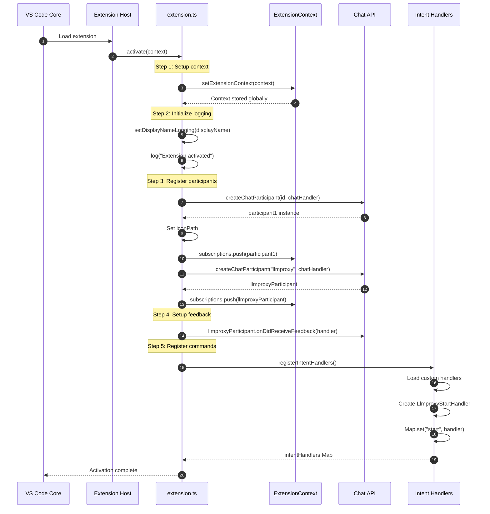

### Handler Registration Detail

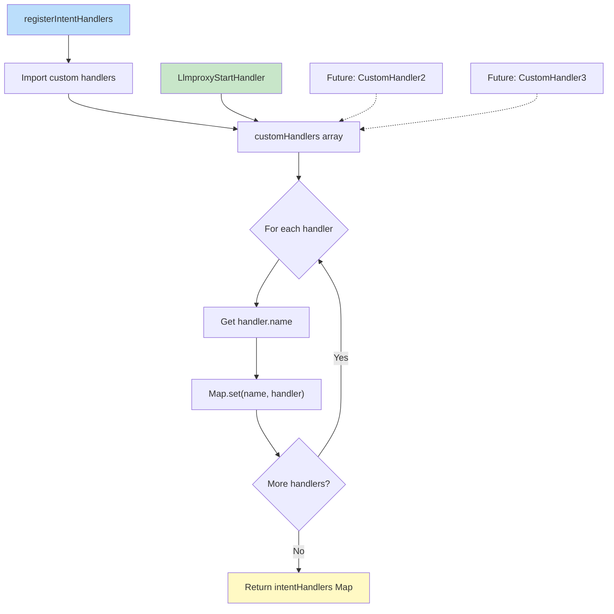

---

## HTTP Request Processing

### Detailed Request/Response Flow

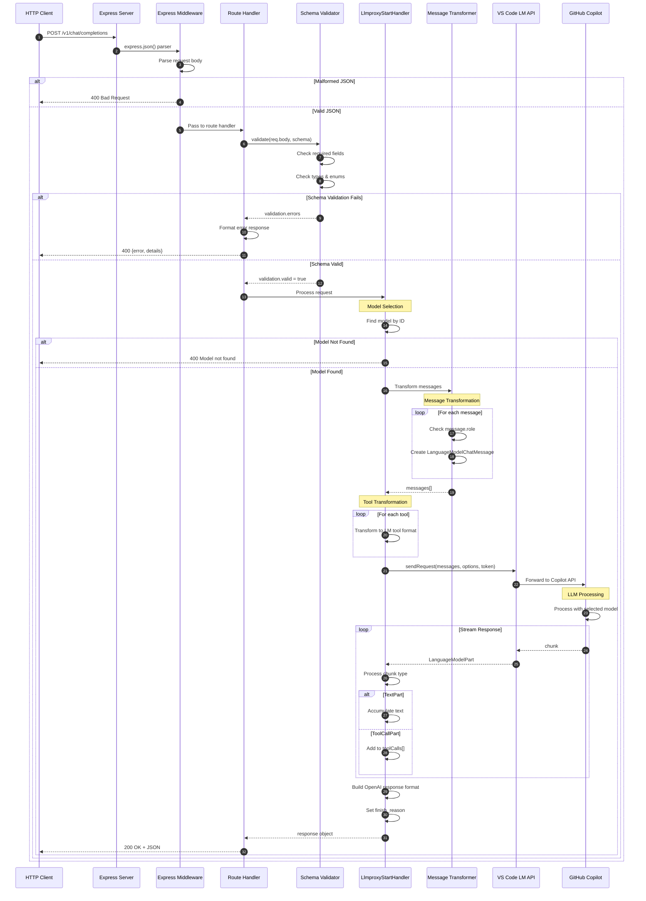

### Model Selection Logic

```mermaid
flowchart TD
    A[Receive request.model] --> B{model specified?}
    B -->|No| C[Use models[0] default]
    B -->|Yes| D[models.find by ID]
    D --> E{Model found?}
    E -->|No| F[Throw Error: Model not found]
    E -->|Yes| G[Set modelInstance]
    C --> G
    G --> H[Log selected model]
    H --> I[Return modelInstance]
    F --> J[Send 400 error to client]
    
    style G fill:#c8e6c9
    style F fill:#ffccbc
```

---

## Message Transformation Details

### OpenAI to VS Code LM Message Mapping

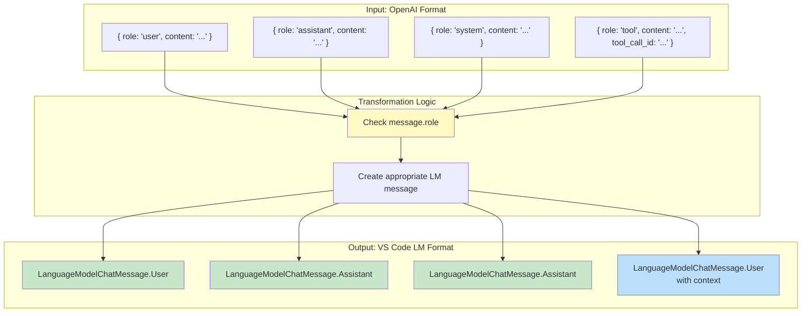

### Implementation Code Flow

```mermaid
sequenceDiagram
    participant Input as request.messages[]
    participant Loop as For Loop
    participant Check as Role Check
    participant Create as Message Creation
    participant Output as messages[]
    
    Input->>Loop: Iterate messages
    loop For each message
        Loop->>Check: message.role?
        
        alt role === "user"
            Check->>Create: LanguageModelChatMessage.User(content)
            Create->>Output: Push User message
        else role === "assistant"
            Check->>Create: LanguageModelChatMessage.Assistant(content)
            Create->>Output: Push Assistant message
        else role === "system"
            Check->>Create: LanguageModelChatMessage.Assistant(content)
            Create->>Output: Push Assistant message
        else role === "tool"
            Check->>Create: LanguageModelChatMessage.User(<br/>"Tool result: " + content)
            Create->>Output: Push User message with context
        else content === null
            Check->>Loop: Skip message (continue)
        end
    end
    
    Output-->>Input: Return transformed messages
```

---

## Tool Call Implementation

### Tool Registration and Invocation

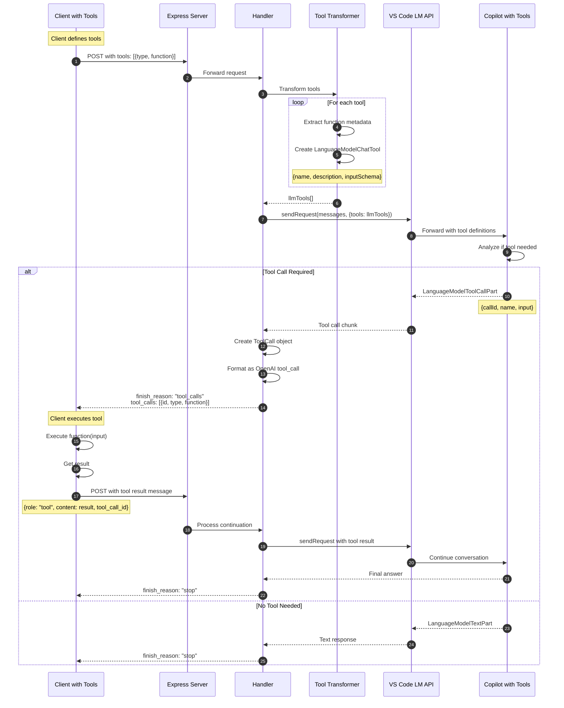

### Tool Schema Transformation

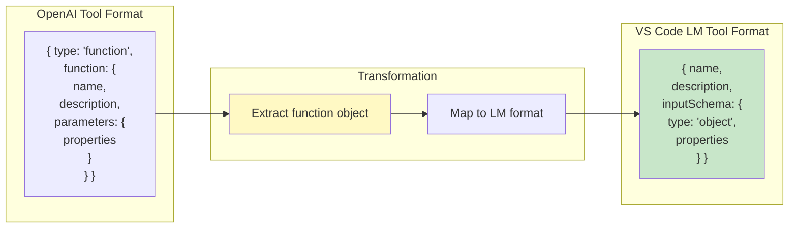

---

## Error Handling Strategies

### Error Classification and Response

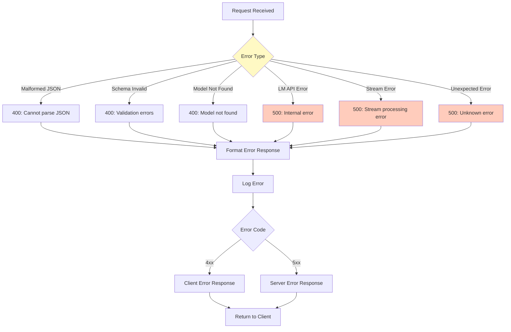

### Error Response Format

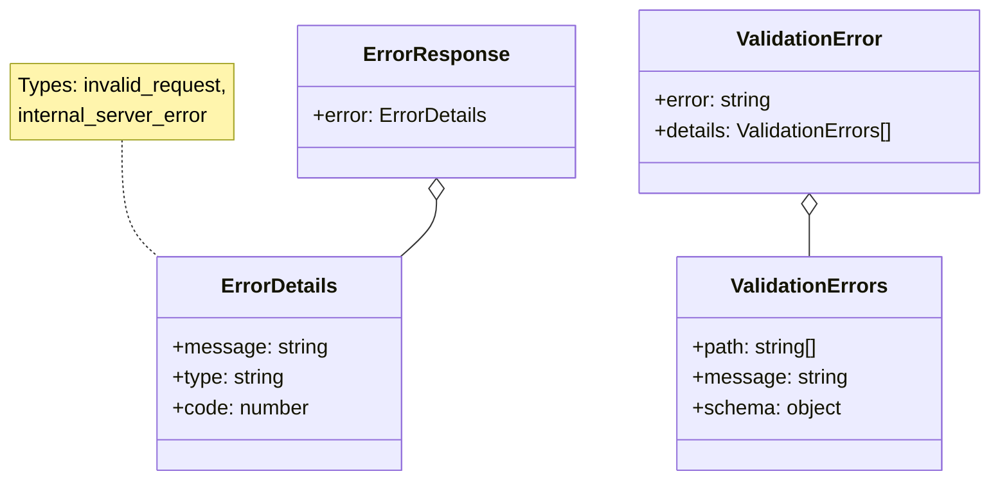

### Try-Catch Pattern

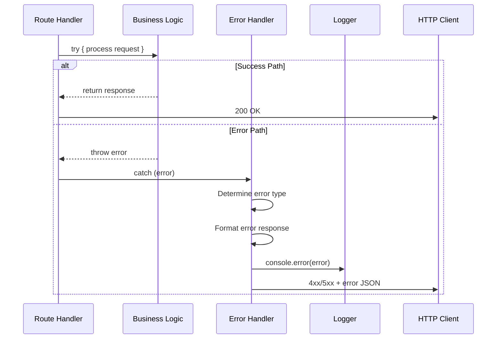

---

## Configuration Management

### Settings Hierarchy

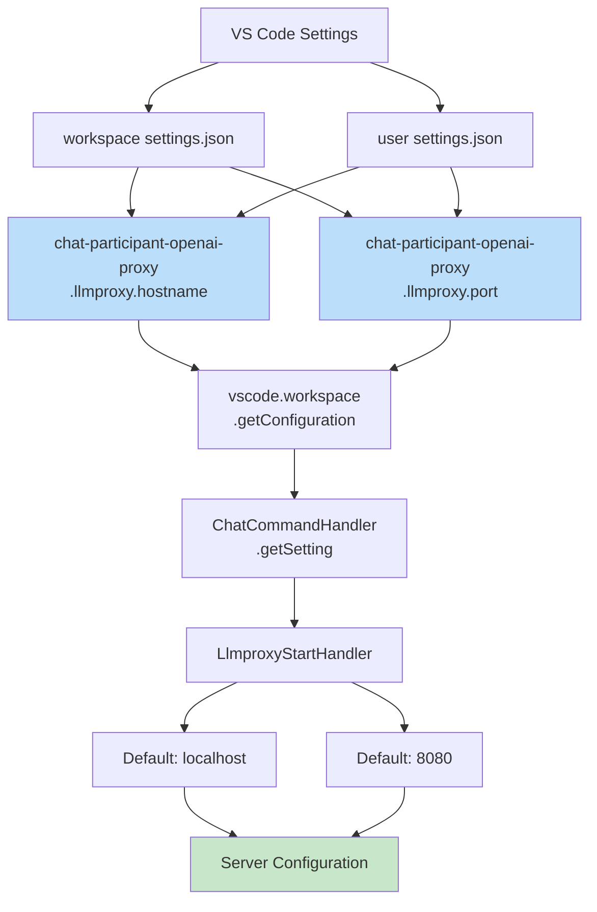

### Configuration Access Pattern

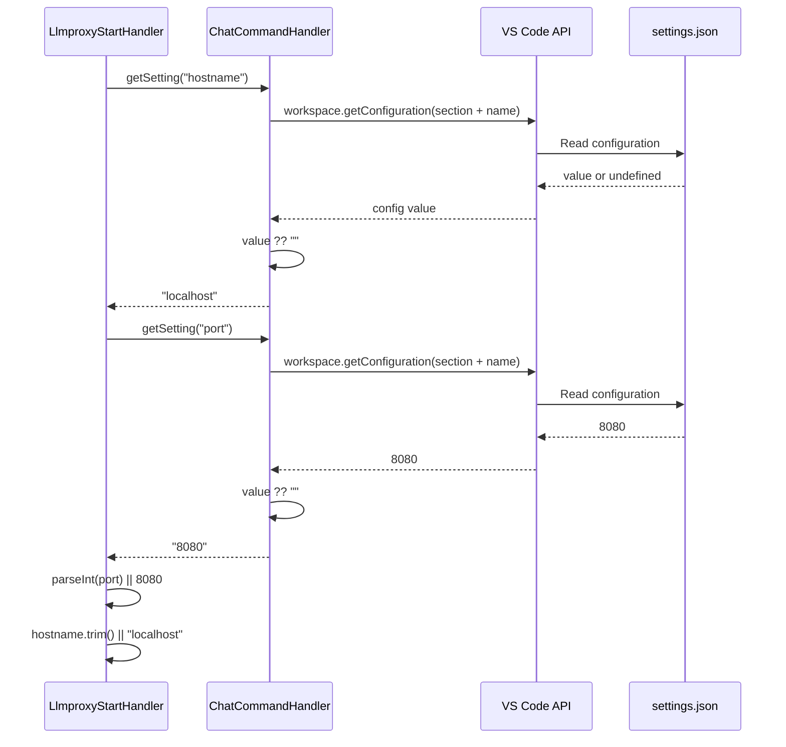

---

## Advanced Features

### Streaming Response (Future Implementation)

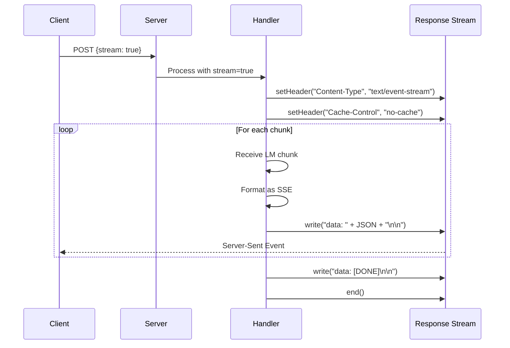

### Multi-Model Support

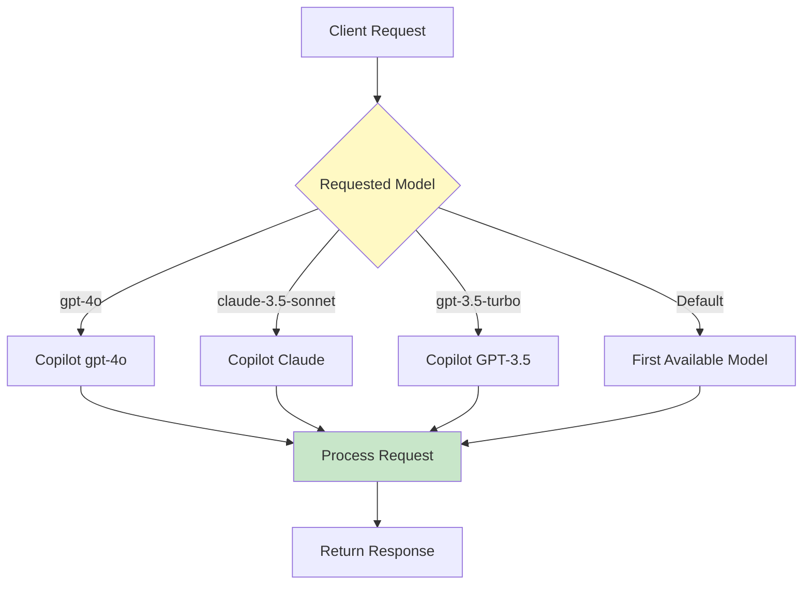

---

## Summary

This technical documentation covers:

1. **Initialization**: Complete extension activation sequence with all registration steps
2. **Request Processing**: Detailed HTTP request handling with validation and transformation
3. **Message Transformation**: OpenAI to VS Code LM API message format conversion
4. **Tool Calls**: MCP tool implementation with invocation and result handling
5. **Error Handling**: Comprehensive error classification and response patterns
6. **Configuration**: Settings hierarchy and access patterns

These flows ensure robust, predictable behavior and provide clear patterns for extending the proxy functionality.
